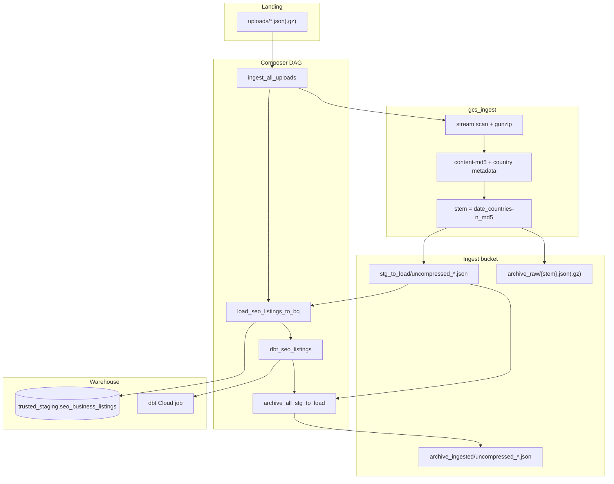

# Architecture: SEO listing GCS ingest

Composer owns the graph. `gcs_ingest` owns stream scan, promote,
archive, and the CLI. BigQuery load is the stock GCS→BQ operator;
dbt is a Cloud job id (EmptyOperator when unset in this sample).

## Diagram

## Components

**gcs_ingest**  
Public entry points: `ingest_all_uploads`, `archive_all_stg_to_load`,
plus `scan` / `ingest` / `archive` CLI. Magic-byte compression,
single-pass scan+write to uncompressed stage, server-side copy for
raw archive, content-md5 index on archive to skip duplicates.

**DAG**  
Linear chain. Manual trigger. `max_active_runs=1`. Staging load is
`WRITE_TRUNCATE` over `stg_to_load/uncompressed_*.json` with a
schema object from the rawzone bucket.

**dbt step**  
Production uses a dbt Cloud job id. This sample reads
`seo_listings_dbt_job_id` and falls back to EmptyOperator so the
graph still renders without credentials.

## Why raw_download + stdlib gzip?

Composer workers with urllib3≥2.6 hit a mismatch when the GCS
client's `_GzipDecoder` lacks `max_length`. Opening blobs with
`raw_download=True` and decompressing in-process avoids that class
of opaque stream failures on large dumps. Worth the extra code.
