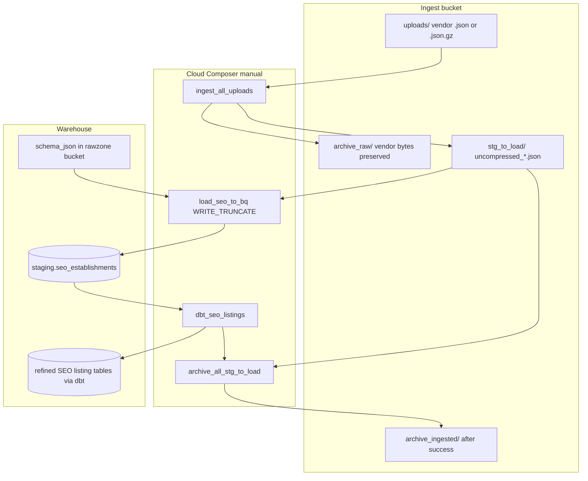

# Architecture: SEO business-listing GCS ingest

One Composer DAG. Four prefixes in one ingest bucket. Stream promote,
wildcard BQ load, dbt Cloud job, then archive. Archive is gated on load
+ dbt success so a failed refine leaves the uncompressed copy in
`stg_to_load/`.

## Diagram

## Components

**seo_gcs_ingest.ingest_all_uploads**  
Lists `uploads/`, detects gzip via magic bytes, stream-scans NDJSON for
country set + timestamp bounds + content md5, writes
`stg_to_load/uncompressed_{stem}.json`, server-side copies vendor bytes
to `archive_raw/`, deletes the landing object. Stem =
`{YYYYMMDD}_countries-{n}_{raw_md5[:8]}`.

**GCSToBigQueryOperator (load_seo_to_bq)**  
Wildcard load of `stg_to_load/uncompressed_*.json` into
`staging.seo_establishments` with `WRITE_TRUNCATE`. Schema from the
rawzone bucket, not the ingest bucket.

**dbt_seo_listings**  
`DbtCloudRunJobOperator` when the job Variable is set; EmptyOperator in
DEV so the chain shape stays stable without calling dbt Cloud.

**seo_gcs_ingest.archive_all_stg_to_load**  
Moves uncompressed staging objects into `archive_ingested/` after the
upstream chain succeeds. Dry-run CLI defaults until `--apply`.

## Why archive after dbt?

If you archive right after the BQ load, a dbt failure leaves you with
vendor bytes in `archive_raw/` and an empty / stale staging table —
recoverable, but you lose the already-uncompressed loadable copy.
Gating archive on dbt means a failed refine can be re-run from
`stg_to_load/` without re-promoting.

## Why magic-byte compression, not filename?

Vendor drops have arrived as `.json` that were actually gzip, and as
`.json.gz` that were plain. Filename heuristics failed silently.
Reading the first two bytes (`\x1f\x8b`) is cheap and correct.

## CLI vs Composer

Same helpers. CLI defaults to dry-run JSON preview so you can validate
stems / metadata before mutating GCS. Composer tasks always apply.
`gcp_conn_id` is accepted for Airflow wiring but the helper uses ADC /
`storage.Client` — connection id is deliberately unused inside the
Python callable.
