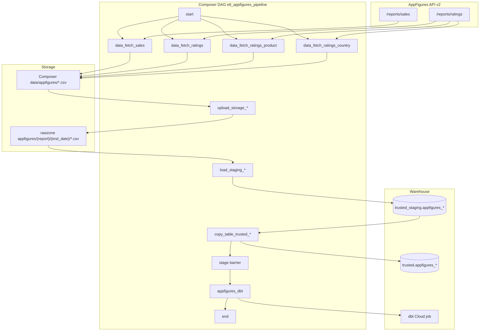

# Architecture: AppFigures weekly ingest

Composer owns the graph. `fetch_appfigures_data` owns the HTTP + local
CSV write. Stock GCS / BigQuery operators move bytes and rows. dbt
Cloud runs after a fan-in barrier.

## Diagram

## Components

**fetch_appfigures_data**  
Maps `file_name` → report type + `group_by`, calls AppFigures with a
Bearer token from Airflow Variable, writes CSV under the Composer
data volume. Sanitized version raises on non-200.

**DAG chains**  
For each of four filenames: fetch → GCSToGCS → GCSToBigQuery
(TRUNCATE staging) → BigQueryToBigQuery (APPEND trusted) → `stage`.
`chain(start, …, stage)` fans out from start and fans in at stage.

**dbt step**  
Production used a fixed Cloud job id. Sample reads
`appfigures_dbt_job_id` and falls back to EmptyOperator so the graph
renders without credentials.

## Why four chains instead of one looped load?

Each report has a different schema and `group_by`. Parallel chains
give independent retries and clearer task failure signals in the UI.
A single dynamic-mapped task would be cleaner in Airflow 2.3+, but
the production DAG predated that habit and the parallel layout is
still easy to operate.
