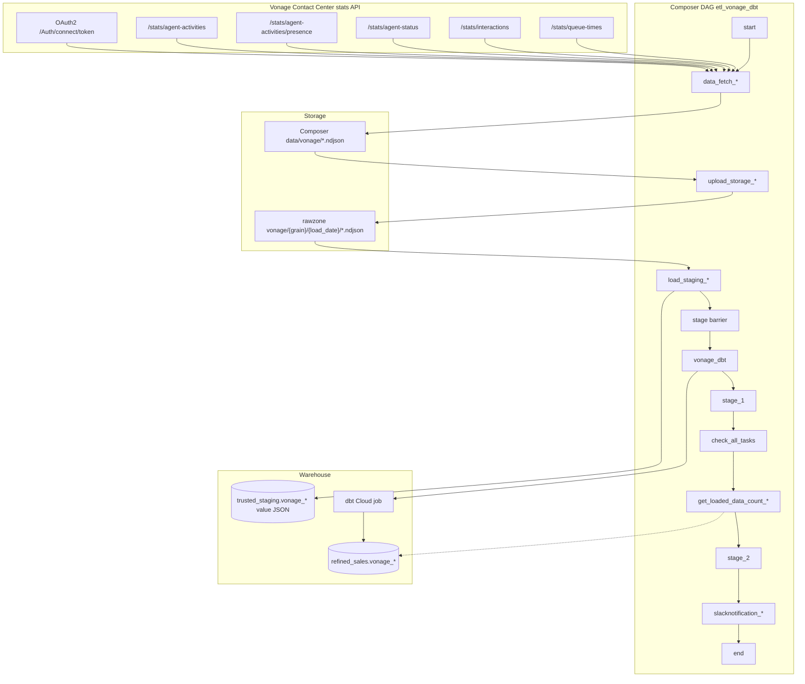

# Architecture: Vonage Contact Center daily ingest

Composer owns the graph. `fetch_vonage_data` owns OAuth, pagination,
and the local NDJSON write. Stock GCS / BigQuery operators move
bytes and rows. dbt Cloud runs after a fan-in barrier. Slack status
is best-effort after refined counts.

## Diagram

## Components

**fetch_vonage_data / VonageAPI**  
Client-credentials token with `scope=stats`, Accept header pinned to
`application/vnd.newvoicemedia.v3+json`, page until
`len(items) == 0` or `totalCount` reached. Refresh once on 401/403
mid-pagination. Writes NDJSON under the Composer data volume.

**DAG chains**  
For each of five filenames: fetch → GCSToGCS → GCSToBigQuery
(TRUNCATE staging, schema = single JSON `value` column) → `stage`.
`chain(start, …, stage)` fans out and fans in.

**dbt step**  
Production used a fixed Cloud job id. Sample reads
`vonage_dbt_job_id` and falls back to EmptyOperator so the graph
renders without credentials.

**Slack status**  
After dbt, one shared `check_all_tasks` summary plus per-grain
refined `COUNT` where `loaded_date = CURRENT_DATE()`. Soft-fails if
the webhook is missing — extract/load should not die on chat.

## Why opaque JSON staging?

Contact-center payloads are nested and version-sensitive. Loading
each line as `value JSON` with a tab delimiter keeps the extract
contract stable when the vendor adds fields. Cost is pushed to dbt,
where column contracts are easier to review. Tradeoff: staging is
not query-friendly for ad-hoc SQL; that is fine for a land-and-
transform pattern.
