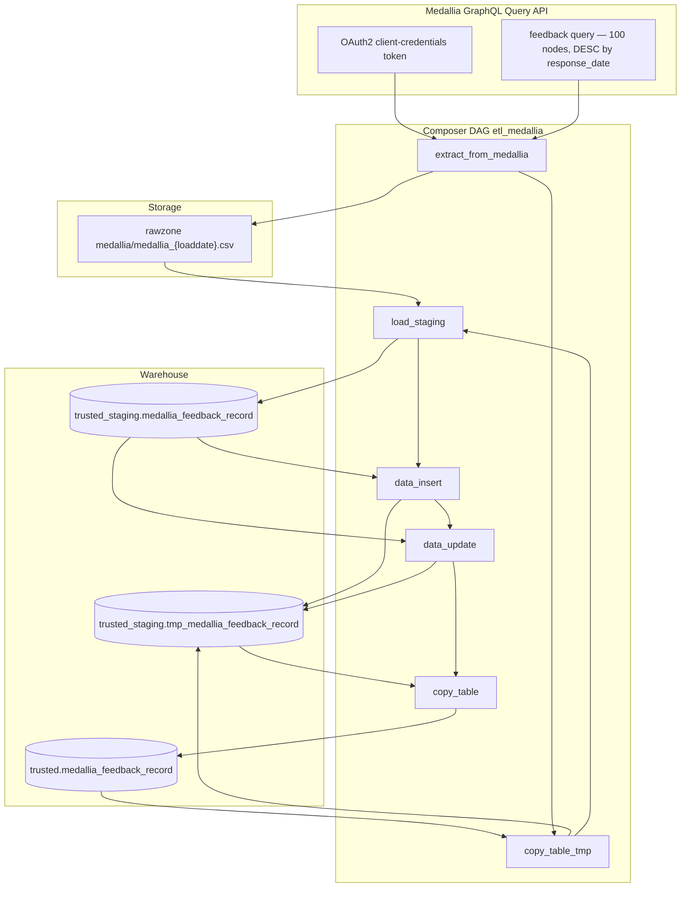

# Architecture: Medallia feedback SCD Type 2 ingest

Composer owns the graph. `extract_medallia` owns OAuth, GraphQL
pagination, MD5 key/row hashes, and the GCS CSV write. Stock GCS /
BigQuery operators load staging and run the inline SCD2 SQL. There
is no dbt barrier on this DAG — historization stays in the
operators.

## Diagram

## Components

**extract_medallia**  
Client-credentials token cached under `/tmp/medallia_token.json`
with a five-minute early refresh. GraphQL pages until
`hasNextPage` is false, the iteration cap hits 2000, or the oldest
`response_date` in the accumulated frame falls outside the lookback.
`_keyhash` = MD5(establishment_id + response_date). `_rowhash` =
MD5 of the survey field pipe-join. Newlines stripped before CSV.

**copy_table_tmp**  
WRITE_TRUNCATE snapshot of trusted → tmp. Gives the insert/update
steps a working copy so a failed mid-run does not leave trusted
half-closed. Promote is an explicit final copy.

**load_staging**  
GCSToBigQuery CSV truncate into staging. Schema comes from a
Composer schema object (`schema_json/medallia_feedback_record.json`).
Headerless CSV — column order is the OrderedDict in the extract.

**data_insert / data_update**  
Insert: append staging rows whose concat(keyhash, rowhash) is not
among currently valid trusted Medallia rows. Update: close valid
tmp rows inside the lookback whose hash pair is absent from
staging. Hour-truncateded `_valid_from` / `_valid_until`.

## Why inline SCD2 instead of dbt?

This DAG predates the house preference to move Type 2 into dbt
(see Offer Tool / MCC country patterns). Leaving the SQL in the
operators kept the change surface small when survey fields were
added in 2026-05. Tradeoff: the insert SELECT is harder to unit
test than a dbt model, and a missing comma in production already
proved that. Sample fixes that comma. A future rewrite should move
the hash compare into dbt and keep Composer on extract + load.
