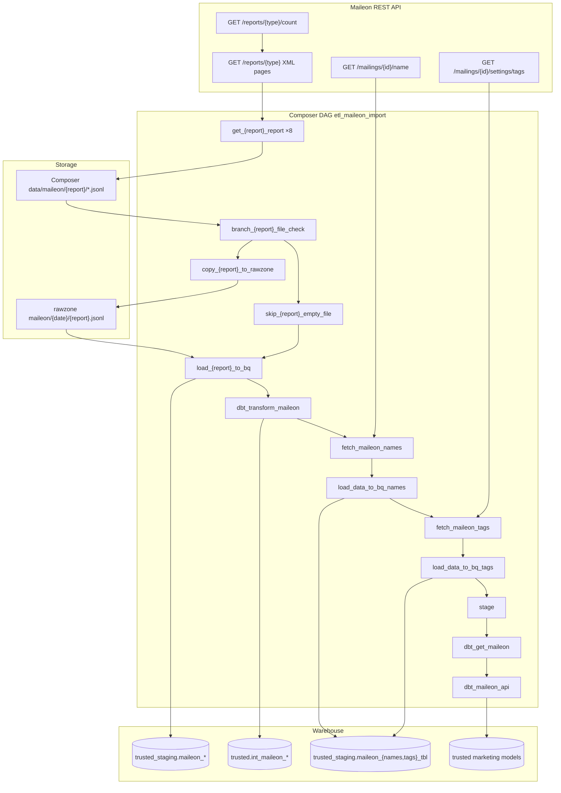

# Architecture: Maileon email marketing import

Composer orchestrates eight parallel extract→branch→copy|skip→load
chains, then a metadata + dbt tail. The Python client owns XML
pagination and JSONL landing; stock GCS / BigQuery operators move
bytes; dbt Cloud owns trusted transforms.

## Diagram

## Components

**MaileonAPI (`maileon_api.py`)**  
Basic-auth client. Prefetches `/count`, pages at 1000 rows, parses
XML with xmltodict, maps contact + event fields, writes JSONL under
the Composer data path (synced to the Composer bucket). Prefers the
normalized `records` list from the XML cleaner when present.

**Empty-file branch**  
`BranchPythonOperator` checks Composer blob size. Non-empty →
GCSToGCS into rawzone → GCSToBigQuery. Empty/missing → EmptyOperator
skip, then join on the load task (`none_failed_or_skipped`).

**Metadata enrichment (`get_maileon_metadata.py`)**  
After the first dbt job, UNION distinct `mailing_id` from
`int_maileon_*`, then sequential name lookups. Tags read from the
names staging table. Retries 429/500 with exponential backoff.

**dbt Cloud**  
Three jobs: report transforms, names/tags models, API integration
models. Job IDs come from Variables; missing IDs fall back to
EmptyOperator so the graph still renders in a reference checkout.

## Design notes

Parallel report branches isolate vendor flakiness. WRITE_TRUNCATE
keeps daily staging idempotent for re-runs. Parse-time
`datetime.now()` for report dates is an inherited footgun — prefer
`{{ ds }}` in a real deploy. The skip→load join can truncate staging
on empty days; call that out in ops runbooks if you copy the graph.
