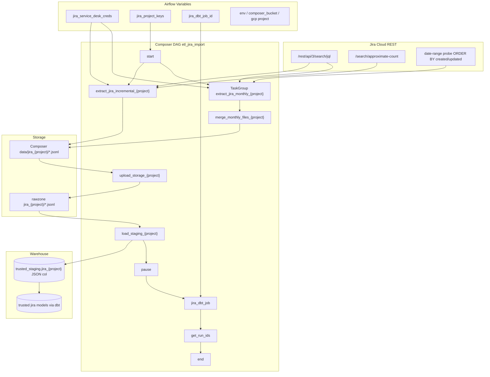

# Architecture: Jira Service Desk ingest

Composer owns the graph. `jira_client.py` owns JQL, ADF flattening,
pagination, and rate-limit backoff. Stock GCS / BigQuery operators move
bytes. dbt Cloud owns trusted models and dedupe.

## Diagram

## Components

**jira_client.py**  
Runtime Variable for username/token. Recursive ADF walker for
description + comments. `nextPageToken` pagination with 429/5xx
backoff. Checkpoint JSONL every 10k issues on long pulls.
`get_jira_project_date_range` is the parse-time probe used only when
`FULL_LOAD_MODE` is True.

**dag_jira_ingest.py**  
Loops configured project keys. Incremental tasks bind
`data_interval_start` → `data_interval_end`. Full-load builds monthly
PythonOperators inside a TaskGroup, then merges shards before the
shared upload/load tail. dbt job id comes from a Variable; missing id
renders an EmptyOperator so the graph still opens in a reference
checkout.

**Staging contract**  
JSONL → GCS → BigQuery CSV load with tab delimiter and a single JSON
`value` column, WRITE_APPEND. dbt is responsible for exploding fields
and deduping on issue key + updated timestamp.

## Design notes

Parse-time date probes mean FULL_LOAD_MODE can fail DAG import if Jira
is down or the token is expired — that is intentional for a backfill
switch you flip by hand, not for the default schedule. Keep production
on `FULL_LOAD_MODE = False`.

Landing `*all` fields is deliberate schema debt. Support projects add
custom fields monthly; a rigid BQ schema would break the load more
often than JSON staging costs us in bytes.
