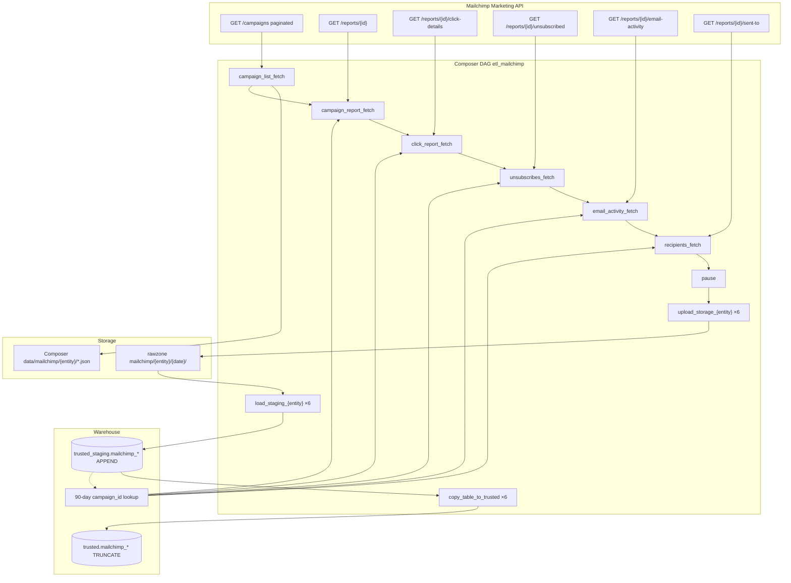

# Architecture: Mailchimp email analytics ingest

Composer runs a two-phase DAG. Phase 1 is a serial extract chain on
the Mailchimp Marketing SDK. Phase 2 fans six land+load chains from
a pause barrier into GCS rawzone and BigQuery.

## Diagram

## Components

**MailChimp base (`mailchimp_api.py`)**  
Configures the official `mailchimp_marketing` client (api_key +
server prefix). `_query_results` selects distinct campaign IDs from
staging with `DATE(sent_time) >= CURRENT_DATE() - 90`.

**Entity extractors**  
Six subclasses flatten nested API payloads into one JSON object per
row and write JSONL. Campaign list pages at 100; click / unsubscribe
/ activity / recipients page at 1000. Campaign-scoped fetchers wrap
each ID in a 10-attempt retry loop so one flaky campaign does not
abort the whole grain.

**DAG (`dag_mailchimp_pipeline.py`)**  
Serial PythonOperators into `pause`, then a Python `for` loop builds
six parallel GCSToGCS → GCSToBigQuery (APPEND, day partition) →
BigQueryToBigQuery (TRUNCATE into trusted) chains that all join on
`end`.

## Design notes

Serial extracts keep API pressure predictable and match production
ordering. Parallel land/load after pause isolates GCS/BQ failures
per grain without re-pulling the Marketing API. Staging APPEND plus
trusted TRUNCATE means trusted always mirrors the full staging
history for that table — plan a retention / partition expiry job if
you copy this graph, or switch staging to TRUNCATE per day like
pattern 31.
