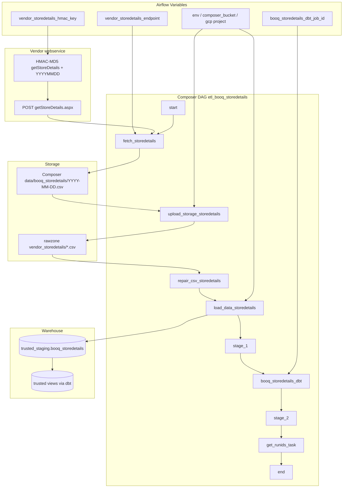

# Architecture: POS vendor store-details HMAC ingest

Composer owns the graph. `storedetails_api.py` owns HMAC signing,
header validation, and CSV column repair. Stock GCS / BigQuery
operators move bytes. dbt Cloud owns trusted models after staging
lands.

## Diagram

## Components

**storedetails_api.py**  
Builds the daily HMAC, POSTs for semicolon CSV, validates the full
header tuple before writing anything, repairs overflow into the address
column, and exposes `repair_csv_in_gcs` for the second normalize pass.

**dag_booq_storedetails.py**  
Linear chain with DEV/PROD env switch for project, rawzone bucket, and
GCP connection. dbt job id comes from a Variable; missing id or missing
provider package renders an EmptyOperator so the graph still imports in
a reference checkout. Run-id helper writes an Airflow Variable for ops
follow-up when dbt actually ran.

**Staging contract**  
Comma CSV → GCS → BigQuery with schema JSON from the rawzone bucket,
`WRITE_TRUNCATE`, skip header row. dbt owns the trusted / refined layer.

## Design notes

Failing on header mismatch at fetch time is intentional. A silent
schema drift that loads into the wrong columns is worse than a red DAG
at 07:05. Keep `EXPECTED_HEADER`, the GCS schema JSON, and dbt models
in the same change set when the vendor ships a new flag column.

The dual repair (local + GCS) exists because we once saw a post-copy
reparse still trip BigQuery. It is belt-and-braces, not elegance. If
you rewrite, pick one place and add a row-count / column-count check
after load instead.
