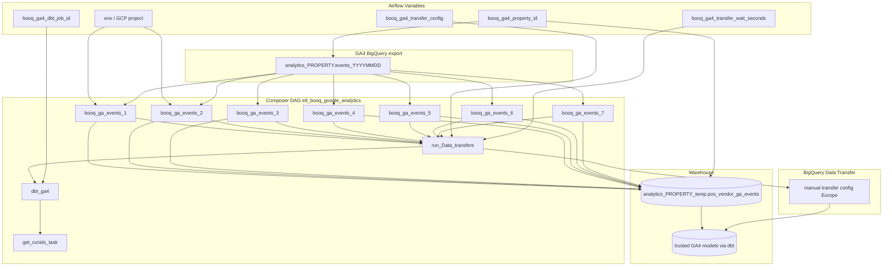

# Architecture: POS vendor GA4 rolling event ingest

Composer fans out seven day-scoped BigQuery jobs against the native
GA4 export dataset, then sequences a Data Transfer kick, one dbt Cloud
job, and run-id capture. Staging is a dedicated temp dataset next to
the GA4 property export — not the main trusted zone.

## Diagram

## Components

**dag_booq_ga4.py**  
Builds the seven `BigQueryInsertJobOperator` tasks in a loop
(`day_offset` 1..7), wires them into transfer → dbt → runids, and
switches GCP project / connection on DEV vs PROD. dbt job id and GA4
property id come from Variables; missing dbt provider or job id
renders an EmptyOperator so the graph still imports in a reference
checkout.

**ga4_transfer.py**  
Starts a manual BigQuery Data Transfer run from a Variable-held
config resource name, sleeps a configurable wait (default 360s), and
logs the start response without asserting SUCCESS. Also holds the
shared dbt run-id collector used by `get_runids_task`.

**Staging contract**  
Per day: DELETE rows for that `event_date`, then INSERT the full GA4
event column set from `events_*` filtered on `_TABLE_SUFFIX`. Nested
structs (`event_params`, `user_properties`, `ecommerce`, `items`) are
preserved as exported.

## Design notes

Seven tasks instead of one BETWEEN window matches what ran in
production and keeps per-day retries isolated. Consolidating to a
single query is a reasonable rewrite if you also move dates to
`{{ ds }}` macros.

The transfer sleep is intentional technical debt. Polling
`TransferRun.state` would remove the magic number and catch failures
before dbt starts; do that before you shorten `dagrun_timeout` further.
