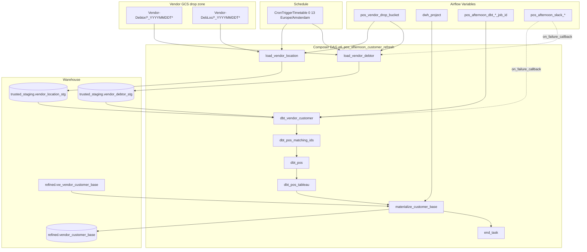

# Architecture: Midday POS customer-master refresh

Composer owns schedule and graph. `customer_master_load.py` owns
blob selection and staging load. dbt Cloud owns trusted/refined
models after staging lands. A final BigQuery job materializes the
customer-base view for BI extracts.

## Diagram

## Components

**customer_master_load.py**  
Resolves the newest same-day blob per table prefix, then TRUNCATE-loads
semicolon CSV into `*_stg` with an explicit schema. Soft-skips when no
matching object exists.

**dag_pos_afternoon_refresh.py**  
Timezone-aware timetable, two parallel load tasks fanning into one dbt
chain, view → table materialize, Slack failure callback. dbt tasks
become EmptyOperators when the Cloud provider or job-id Variable is
missing so the reference checkout still imports.

**Overnight boundary**  
Full-table SCD / hash merge lives in the overnight POS DAG and dbt
models. Afternoon does not re-implement Type 2 SQL; it refreshes the
two customer-master staging tables the shared models already read.

## Design notes

Both load tasks wire `>> dbt_vendor_customer`. Airflow treats that as
a fan-in: dbt starts once after both loads finish (or soft-skip). Do
not put the dbt chain inside the for-loop as a duplicated linear
edge set if you rewrite — keep one shared chain.

`DATE_TOKEN` is evaluated at DAG parse time, same as production. That
is fine for a daily Composer environment that re-parses overnight; it
is wrong for historical backfills. If you need backfills, thread
`{{ ds_nodash }}` into the callable and align the vendor object-name
convention.
