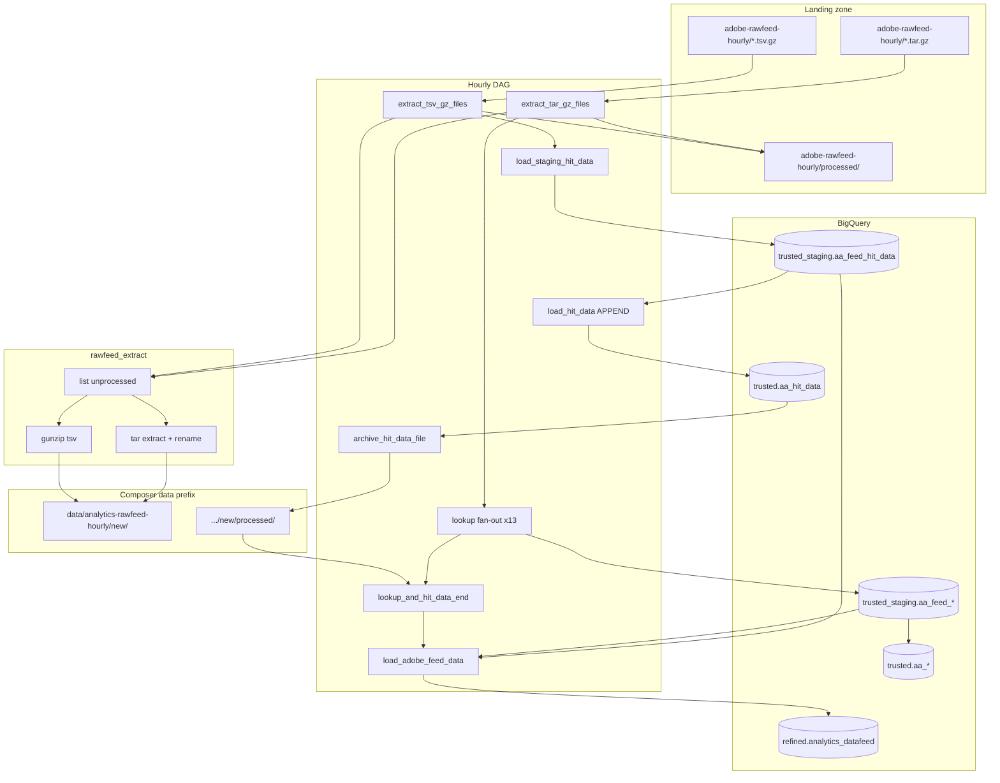

# Architecture: Adobe Analytics hourly Data Feed

Composer owns the graph. `rawfeed_extract` owns landing-zone list /
unpack / processed-move. BigQuery load uses stock GCS→BQ and insert-job
operators. Refined enrich is a SQL file joined at DAG parse/runtime.

## Diagram

## Components

**rawfeed_extract**  
Lists landing objects, skips `processed/` prefixes, downloads to
`/tmp/gcs_extracted/`, either extracts a tar or gunzips a TSV, uploads
into the Composer `new/` prefix with a suite-stem suffix, then
copy+delete into landing `processed/`.

**Hit branch**  
TSV glob `01-{report_suite}_*` → staging TRUNCATE (tab CSV, schema
object from rawzone) → trusted APPEND with lineage columns → move
objects under `new/processed/`.

**Lookup fan-out**  
For each of 13 dimension names: glob `{table}_{report_suite}_*` →
staging TRUNCATE with inline key/value schema → DISTINCT rewrite →
trusted TRUNCATE with `_keyhash` / `_rowhash` → archive. All branches
converge on `lookup_and_hit_data_end`.

**Refined enrich**  
`refined_hit_query.sql` LEFT JOINs staging lookups, builds visit/hit
IDs, hashes IP, decodes Adobe status codes, remaps a sanitized eVar /
prop set, and APPENDS rows whose `hit_id` is not already in refined
for `visit_start_time_gmt_dt >= CURRENT_DATE() - 1`.

## Why max_active_runs=1

Hourly unpack + TRUNCATE staging is not re-entrant. Overlapping runs
would race the same `new/` prefix and clobber staging mid-load. One
active run keeps land → stage → archive ordered per hour; missed hours
are recovered by whatever files remain unprocessed in landing.
