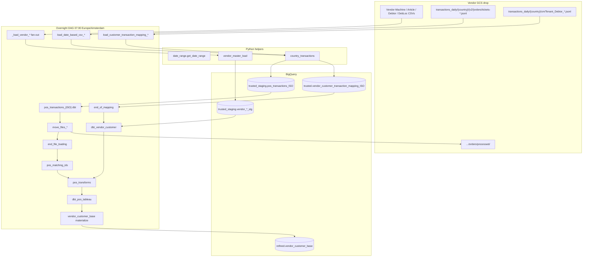

# Architecture: Overnight multi-country POS

Composer owns the graph. Helper modules own GCS→BQ landers. dbt Cloud
owns trusted SCD merge and ticket unpack. A final BigQuery insert job
materializes the refined customer-base view as a table for BI tools
that prefer tables over views.

## Diagram

## Components

**date_range**  
Resolves daily (yesterday) vs backfill (closed Variable range) into a
list of `YYYYMMDD` strings. Load and move callables share this so a
backfill cannot archive a different set than it loaded.

**vendor_master_load**  
Lists vendor-prefixed CSVs, TRUNCATE-loads semicolon files into
`*_stg`, and exports `_rowhash` / `_keyhash` SQL used by the trusted
SCD layer. Overnight historically took the first matching blob;
afternoon (#43) later switched to newest-by-mtime for the same prefixes.

**country_transactions**  
Per ISO: APPEND ticket JSONL as a single JSON column, TRUNCATE mapping
JSONL into trusted, then copy+delete tickets into `processed/` after
country dbt succeeds. Soft-skips missing days so one dark market does
not fail the whole run.

**DAG graph**  
Master and mapping fan into customer dbt. Ticket branches fan into
`end_file_loading`, then matching → POS → Tableau → materialize.
`max_active_runs=1` avoids overlapping backfills fighting the same
staging tables.
