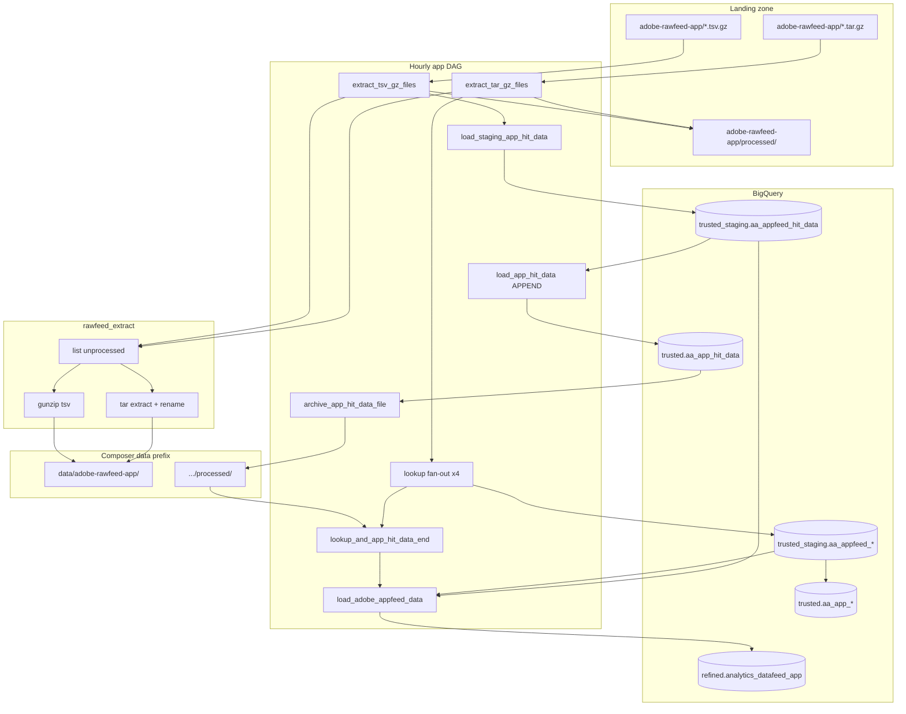

# Architecture: Adobe Analytics app Data Feed

Composer owns the graph. `rawfeed_extract` owns landing-zone list /
unpack / processed-move under the *app* prefix. BigQuery load uses
stock GCS→BQ and insert-job operators. Refined enrich is a SQL file
joined at DAG parse/runtime — mobile projection, four lookups.

## Diagram

## Components

**rawfeed_extract**  
Lists `adobe-rawfeed-app/` landing objects, skips `processed/`,
downloads to `/tmp/gcs_extracted_app/`, either extracts a tar or
gunzips a TSV, uploads into the Composer `data/adobe-rawfeed-app/`
prefix with a suite-stem suffix, then copy+delete into landing
`processed/`.

**Hit branch**  
TSV glob `01-{app_report_suite}_*` → staging TRUNCATE (tab CSV, app
schema object from rawzone, `max_bad_records=1000`) → trusted APPEND
with lineage columns → move objects under Composer `processed/`.

**Lookup fan-out (×4)**  
`connection_type`, `country`, `languages`, `operating_systems`:
staging TRUNCATE with inline key/value schema → DISTINCT rewrite →
trusted TRUNCATE with `_keyhash` / `_rowhash` → archive. All branches
converge on `lookup_and_app_hit_data_end`.

**Refined enrich**  
`refined_app_hit_query.sql` LEFT JOINs connection / country / OS,
projects app eVars (product, user, establishment, screen, event),
normalizes device brand + OS aggregate, computes visit first/last hit
windows, and APPENDS to `analytics_datafeed_app`. No hit_id anti-join
in the shipped source (optional guard left commented).

## Why max_active_runs=1

Same reason as #49: hourly unpack + TRUNCATE staging is not
re-entrant. Keeping a separate DAG from web means app and web can each
hold one active run without sharing a staging race.
