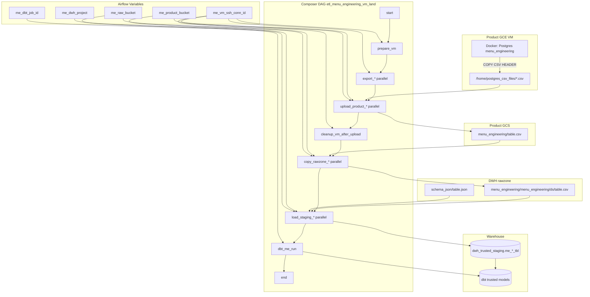

# Architecture: Menu Engineering VM Postgres land

Composer SSHs onto a product GCE VM, exports Dockerised Postgres
tables to CSV, uploads into the product GCS bucket, cleans the VM,
then copies into the DWH rawzone and TRUNCATEs BigQuery staging
before one dbt Cloud job.

## Diagram

## Components

**table_catalog.py**  
Trimmed list of Postgres tables plus schema / staging-prefix
constants. Production carries ~30 tables (per-country address
slices, import ledgers, shifts). The catalog is the only place to
add or remove a land without editing SSH command templates.

**dag_menu_engineering_vm_land.py**  
Stage markers + `chain()` fan-out/fan-in. SSHOperator for prepare /
export / product upload / cleanup. GCSToGCS for the IAM boundary.
GCSToBigQuery with explicit schema objects and WRITE_TRUNCATE.
dbt Cloud job or EmptyOperator stub when the Variable / provider is
missing.

## Design notes

**Why dual-bucket instead of one hop.** The VM service account
already writes the product bucket. Composer already writes the DWH
rawzone. Crossing those two concerns on one SA creates a permanent
exception in both teams' IAM reviews. The extra GCS copy is cheap
compared to that argument.

**Why cleanup sits after product upload, before rawzone copy.**
CSV deletion is safe once the product bucket has the object. If the
rawzone copy fails, Composer retries from GCS — it does not need
the VM disk. Putting cleanup later would leave large CSVs on the VM
whenever BQ load flakes.

**Parallelism.** Exports and uploads fan out per table. That is
fine on SSH+docker for this workload size; Cloud SQL Admin 409
storms do not apply. Still keep `max_active_runs=1` so two DAG runs
do not share the same CSV filenames.

**Schema JSON.** Autodetect is off. Menu-engineering free-text and
quoted newlines need `allow_quoted_newlines=True` and a reviewed
schema object; autodetection has burned us on type flips.
