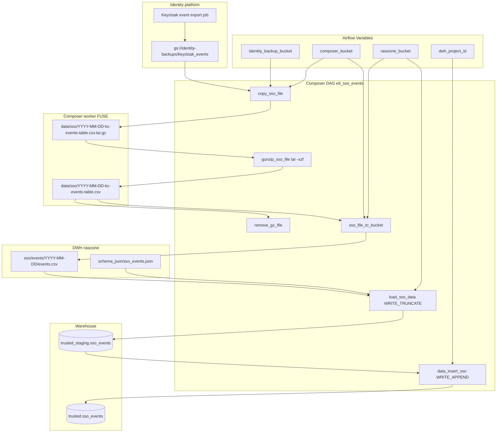

# Architecture: Keycloak SSO events land

Composer copies a daily Keycloak events tarball from the identity
backup bucket onto the worker data mount, unpacks it, republishes the
CSV into the DWH rawzone, TRUNCATEs staging, then APPENDs into trusted
`sso_events` with lineage columns.

## Diagram

## Components

**dag_keycloak_sso_events.py**  
Six sequential tasks. GCSToGCS for the backup→Composer and
Composer→rawzone hops. BashOperator for unpack + tar cleanup.
GCSToBigQuery with an explicit schema object and WRITE_TRUNCATE on
staging. BigQueryInsertJobOperator for the trusted APPEND.

**trusted_append.sql**  
SELECT from staging with `TIMESTAMP_MILLIS(event_timestamp)` and the
standard DWH metadata columns. Kept next to the DAG so the portfolio
sample does not bury the contract inside a giant string literal.
Production load schema lives on the rawzone as
`schema_json/sso_events.json` (columns listed in DATA_FLOW.md).

## Design notes

**Why unpack on the worker.** The identity backup object is a tar.gz.
BigQuery load wants CSV. The Composer `data/` prefix is already FUSE-
mounted on every worker, so `tar -xzf` there is zero new infra. A
streaming Cloud Function would also work; it was not worth another
service for one file a day.

**Why republish to the rawzone.** Staging loads in this platform are
contracted against the DWH rawzone + schema_json objects. Loading
straight from the Composer data prefix would couple trusted loads to
worker-local paths and force a second schema-object location.

**Why append-only trusted.** SSO events are an audit-ish fact: once
landed, they should not be rewritten by a later SCD pass. The cost is
duplicate rows on re-run. Acceptable when the upstream file is daily
and immutable; not acceptable if ops re-runs often — then add a MERGE
or id anti-join before append.

**Parse-time load date.** Production computed yesterday at parse time
so the object name matched the backup job's calendar convention. That
is the main footgun in this graph. Prefer Airflow macros on a rebuild.
