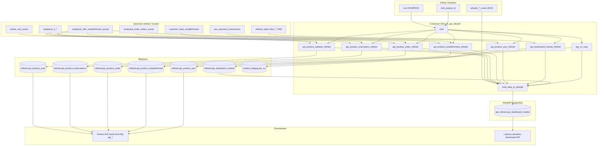

# Architecture: BQ product API refined zone + AlloyDB sync

Composer rebuilds API-facing refined tables in BigQuery, then
incrementally syncs one market dashboard feed into AlloyDB for
low-latency product API reads.

## Diagram

## Components

**dag_bq_alloydb_api_sync.py**  
Seven parallel BigQuery truncate-reloads, then one Python AlloyDB
sync. `max_active_runs=1`. Schedule `2 6 * * *`.

**product_api_queries.py**  
`ProductApiQueries` static builders for website, reservation, order,
establishment, POS KPI, and market dashboard SQL. Demo SFID remaps
use placeholder UUIDs.

## Design notes

**Why dual-store at all.** Most `api_*` tables are queried from
BigQuery by internal services that already pay the BQ latency tax.
The CRM activity dashboard needed Postgres-shaped indexes and
conflict-safe upserts closer to the request path — AlloyDB was already
on the VPC. Syncing every table would have doubled write cost for no
read gain.

**Why truncate on BQ, incremental on AlloyDB.** Refined API tables are
daily contracts: consumers expect a full current snapshot clustered on
establishment. AlloyDB holds an append-mostly activity feed keyed by
`unique_key`; replaying the full history every morning is wasteful when
`ON CONFLICT DO NOTHING` already gives idempotent re-runs.

**Why MD5 unique_key in SQL.** Activity rows lack a single natural key
once Voip / calendar / partner joins fan out. Hashing the identity
columns in BigQuery keeps the serving insert dumb and makes boundary-day
re-scans safe.

**Connection hygiene.** Production used a cursor as a context manager
and left the connection open. The sample returns `(conn, cursor)` and
closes both in `finally`. Creds stay in Variables — the source
`__main__` plaintext password block is gone.
