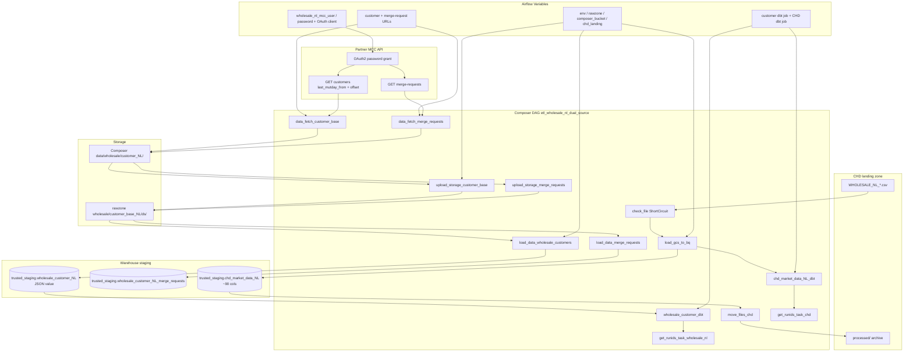

# Architecture: Wholesale NL dual-source land

Composer owns scheduling and fan-out. `makro_customers_api.py` owns
OAuth2, pagination, and CHD CSV clean/validate. Stock GCS / BigQuery
operators move bytes. Two dbt Cloud jobs (customer + CHD) own trusted /
discovery models after staging lands.

Three chains share a DAG id but have no cross-branch edges. That is the
point: optional market files must not block the daily customer mutation
pull, and the reverse.

## Diagram

## Components

**makro_customers_api.py**  
Inbound helpers only: `callAPI` (Bearer + 401 retry), `getdata`
(10k-row offset pagination to JSONL), `getdata_merge_requests`,
`check_file` (schema-driven numeric clean + ShortCircuit bool), and
`schema_fields` for the CHD load. Reverse HubSpot POST helpers are
deliberately absent.

**dag_makro_nl_dual_source.py**  
DEV/PROD switch for project, rawzone, schedule. Customer JSON loads as
CSV/tab into a single JSON column (production contract). CHD uses
explicit schema, `max_bad_records=0`, jagged rows + quoted newlines.
dbt operators degrade to EmptyOperator when the provider or job id is
missing so the reference checkout still imports.

## Design notes

Opaque JSON staging for the customer base is a deliberate tradeoff.
Partner payloads change fields without notice; failing the load on
schema drift would page onboarding more often than it protects
downstream. CHD is the opposite contract — wide typed CSV with zero
bad records — so we clean integers in place first.

`trigger_rule=all_done` on the customer BigQuery load lets the customer
→ dbt chain proceed even if the merge-request branch failed. Watch both
branches in alerting; a single end marker waiting on all three chains
would be a useful follow-up.
