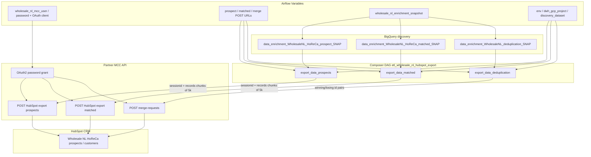

# Architecture: Wholesale NL HubSpot reverse export

Composer owns the manual trigger and fan-out. The export module owns
OAuth2, BigQuery reads, chunking, and POST. Partner MCC sits in front
of HubSpot — we never call HubSpot APIs directly from Composer.

Three PythonOperators share a DAG id and have no cross-task edges.
Prospects, matched, and dedupe can succeed or fail independently; that
matches how CRM ops often re-runs one export type after fixing a
source table.

## Diagram

## Components

**wholesale_nl_hubspot_export.py**  
Outbound helpers only: `callAPI` (Bearer + 401 retry on POST), shared
enrichment SELECT, `export_data_prospects` / `export_data_matched` /
`export_data_deduplication`. Inbound land helpers live in pattern 69.

**dag_wholesale_nl_hubspot_export.py**  
`schedule=None`, `max_active_runs=1`, three parallel PythonOperators.
Dropped unused bucket / conn_id locals that production carried but
never wired into tasks.

## Design notes

In-memory full-table load before chunking is the production contract.
Streaming the BQ iterator into chunks would cut peak memory; I left
the load-then-chunk shape so the pattern matches what ran in Composer
and so failure semantics stay "all rows built, then POST". For very
large prospect tables, prefer an iterator refactor over raising
Composer worker memory.

`sessionid` is random per task run, not per chunk. The partner uses it
to correlate a push; all chunks from one task share the id. Re-raising
API errors (vs production's swallow) means a mid-table failure leaves
HubSpot with a partial session — ops should treat that as a CRM-side
cleanup before re-trigger.
